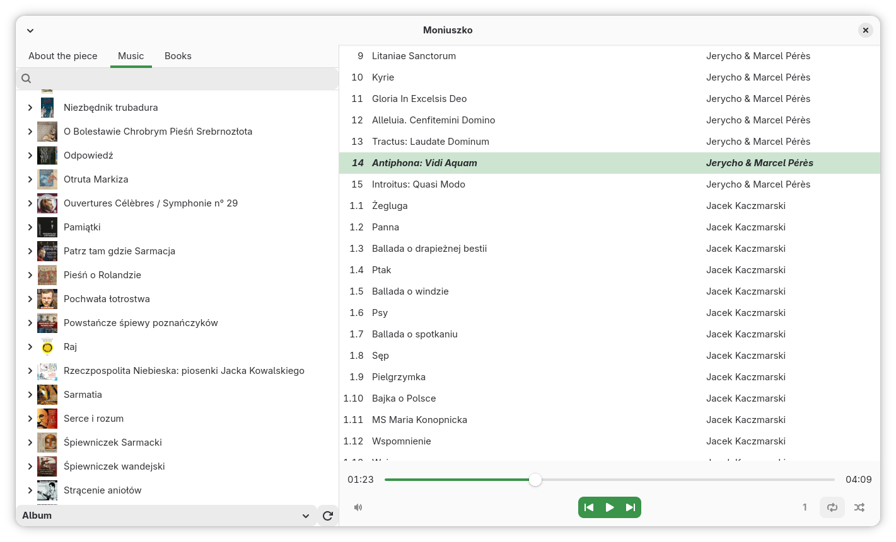
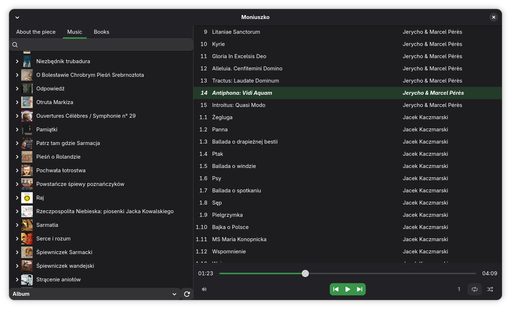

# Moniuszko

Yet another music player. See [Vision](#vision).

## Status

Mostly ready, see [Roadmap](#roadmap).

Warning: first scan may be slow, and requires internet access.

## Screenshots




## Building

for development:

```cargo build```

for install copy `.mo` files from `assets/gettext` to `/usr/share/locale` and build with

```LOCALE_DIR=/usr/share/locale cargo build --release```

## Vision

Why?

- Amarok style -- most existing players focus either on the library (you can play albums)
  or on playlists (you can play manually crafted list of files). Amarok mixes those
  approaches by using library to conveniently create playlists from albums or however you
  want.
- GTK -- Amarok and Strawberry are styled with Qt, which does not fully fit with GTK based
  graphical environments. This project should be written in latest GTK (4 at the moment)
  and libadwaita, so that it integrates well with other GNOME apps.
- MusicBrainz support -- file tags were not meant to store complex relations of tracks,
  albums and artists. If present, MusicBrainz tags should be used to fetch full data.
- audiobooks -- are special case of audio files and should be handled separately

## Roadmap

for 1.3:

- save/load playlist
- save last timestamp in audiobooks

other:

- bigger cover image for mpris
- save library grouping mode, repeat mode and panel tab
- publish on AUR
- complete mpris
- add more data to info panel

# Contributions

are welcome. Just make sure to run rustfmt and ensure no compilation warnings.